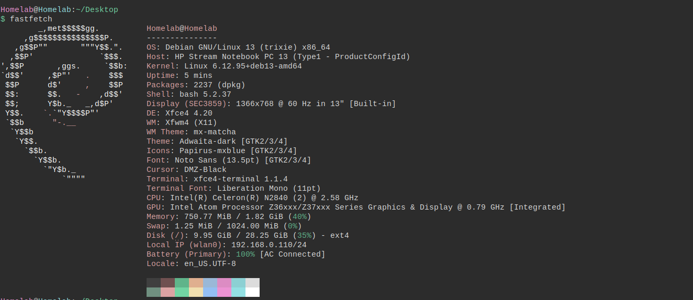

# Introduction
Alright, so this is my first homelab idea outside of school. This is all home grown nonsense, hence the name "homelab". 

The main idea for this homelab, is to provide a hands on environment for learning Linux system administration, networking, and cybersecurity concepts. I, just like any students/enthusiats, wanted to stop watching video and just learn by doing. It was the same advice I received from a Professor at my Community College when I took his class on Linux Fundamentals. 

This project serves as a technical journal and portfolio. Every major change, challenge, and solution will be documented and uploaded to GitHub to demonstrate my learning process and technical growth over time. 

## Homelab Hardware
So, it's best if I explain the whole thing. Like what computers I'll be using and why. So, I am using an HP laptop 13 for my Linux server since it uses a pathetic 2GB of RAM. It used to run Windows 10, but it soon became extremely evident that I can use this as a standalone workstation for Linux. 

The question became... What Linux distro should I install on this PC? Well after looking at my specs, and after some research, I originally installed antiX on the laptop. But... The UI and just the desktop environment was just interesting. Not for me. So, I installed MX Linux XFCE instead. It's lightweight AND I prefer the desktop environment way more. It's more familiar to Debian than antiX was. I will refer to this laptop as "AM" from here on out (From "I have no mouth and I must Scream".)

(I fastfetched the AM's specs above)

The second laptop is my Acer Aspire 3 A315-41 that I primarily use for school work. It has 8GB of RAM (That I should probably upgrade to 16GB tbh). I am using it because I have my Linux VM installed on it. And I can do more with it and leave AM to do the server things since it lacks a lot of resources. I will refer to this laptop as "Test1" from here on out.

I can't show my specs for Test1, but I can write it out:

- Acer Aspire 3 A315-41
- RAM: 8GB
- OS: WIndows 10 with a Debian 13 virtual machine
- Purpose: C++, networking, SSH into my homelab 

## Homelab Project Roadmap
I will divide the steps of what I will do into steps, and each step will have documentation on what I did in each step:

1. Install SSH on AM laptop
2. Find AM's IP Address from AM
3. Ping AM from Test1 laptop
4. SSH into AM from Test1
5. Install Apache on AM
6. Open webpage from Test1
7. Scan with nmap from Test1
8. Secure AM with firewall
9. Break something... Just mess around with the settings (Note: DOCUMENT everything I do)
10. Fix whatever I did